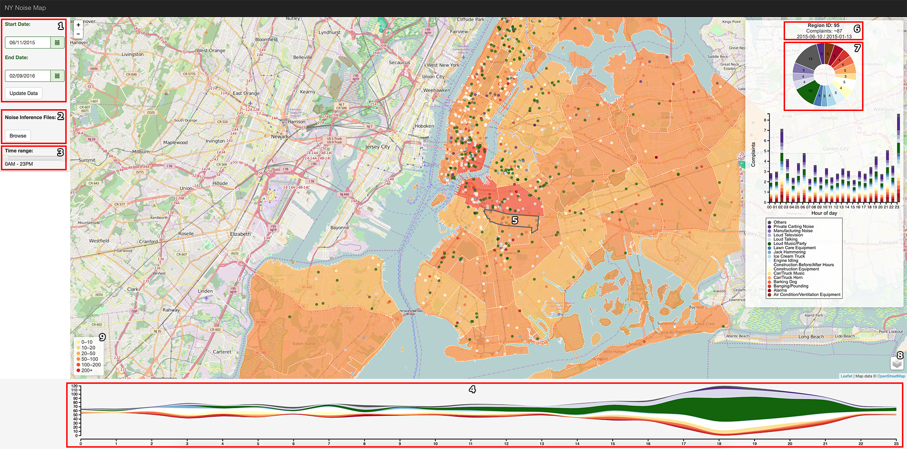

# NYC Noise Inference

Reprodution of the work presented in:

Yu Zheng, Tong Liu, Yilun Wang, Yanmin Zhu, Yanchi Liu, and Eric Chang. 2014. Diagnosing New York city's noises with ubiquitous data. In *Proceedings of the 2014 ACM International Joint Conference on Pervasive and Ubiquitous Computing* (UbiComp '14). ACM, New York, NY, USA, 715-725. DOI=http://dx.doi.org/10.1145/2632048.2632102

#### Project Structure:

```
|- NYCNoise
   |- index.html
   |- CSS
   |- Scripts
   |- Resources
   |- Results
   |- Analysis
```

- **Scripts** contains both scritps to run the inference method (```.py```), as to provide the web visualization tool (```.js```).
- **Resources** contains collect data necessary regarding different aspects of NYC.
- **Results** contais all matrices used in the inference method, named as referenced in the paper. Both the original 311 complaints data (```A-*```) as the inferred noise complaints (```P-*```) are there. Here, ```*``` is in the range [0-23], representing the hours of the day. 
- **Analysis** contains studies performed on the results as on the collected data.

#### Collected Data:

Data collected from [NYC Open Data](https://nycopendata.socrata.com/) and [NYC Prepared](http://data.nycprepared.org).

1. Regions stabilished according to the [community districts](https://nycdatastables.s3.amazonaws.com/2013-08-19T18:22:23.125Z/community-districts-polygon.geojson) of NYC.

2. Geographical Features Considered:

 * Entertainment & Arts
    * [Museums & Galeries](https://nycdatastables.s3.amazonaws.com/2013-06-04T18:02:56.019Z/museums-and-galleries-results.csv)
 * Vehicles
    * [Parking Facilities](https://nycdatastables.s3.amazonaws.com/2013-12-16T21:49:55.716Z/nyc-parking-facilities-results.csv)
 * Business to Business
    * [NY Companies](https://nycdatastables.s3.amazonaws.com/2013-06-20T16:06:05.136Z/mapped-in-ny-companies-results.csv)
 * Education
    * [Public Schools](https://nycdatastables.s3.amazonaws.com/2013-06-11T18:59:27.269Z/nyc-public-school-locations-results.csv)
    * [Private Schools](https://nycdatastables.s3.amazonaws.com/2013-07-29T15:49:03.498Z/nyc-private-school-results.csv)
    * [Special Education](https://nycdatastables.s3.amazonaws.com/2013-07-01T16:25:00.297Z/nyc-special-education-school-results.csv)
    * [Universities & Colleges](https://nycdatastables.s3.amazonaws.com/2013-06-05T14:35:56.387Z/basic-description-of-colleges-and-universities-results.csv)
 * Food & Dining
    * [Sidewalk Cafes](https://nycdatastables.s3.amazonaws.com/2013-06-05T20:25:17.301Z/operating-sidewalk-cafes-results.csv)
 * Health & Beauty
    * [Health Centers](https://nycdatastables.s3.amazonaws.com/2013-06-04T14:40:48.764Z/community-health-centers-results.csv)
 * Profissional & Services
    * [Agencies services](https://nycdatastables.s3.amazonaws.com/2013-07-02T15:29:20.692Z/agency-service-center-results.csv)
 * Shopping
    * [Farmes Market](https://nycdatastables.s3.amazonaws.com/2013-06-13T18:39:44.536Z/nyc-2012-farmers-market-list-results.csv)
    * [Grocery Stores](https://nycdatastables.s3.amazonaws.com/2013-10-18T21:14:52.348Z/nyc-grocery-stores-final.csv)
 * Transport
    * [Subway Entrances](https://nycdatastables.s3.amazonaws.com/2013-06-18T14:29:37.626Z/subway-entrances-results.csv)
 * Travel
    * [Monuments](https://nycdatastables.s3.amazonaws.com/2013-06-04T17:58:59.335Z/map-of-monuments-results.csv)
    * [Landmarks](https://nycdatastables.s3.amazonaws.com/2013-06-18T20:17:34.010Z/nyc-landmarks-results.csv)
 * [Road bed](https://data.cityofnewyork.us/City-Government/road/svwp-sbcd)
 
3. Human Mobility Features 
  * Obtained through [TLC Trip Record Data](http://www.nyc.gov/html/tlc/html/about/trip_record_data.shtml).
  * Collected using [Foursquare API](https://developer.foursquare.com/resources/libraries), specifically, the [*venus/explore*](https://developer.foursquare.com/docs/venues/explore) -- not used due to impossibility to filter by date.
  
4. Noise Categories
   * Obtained from the [311](http://www1.nyc.gov/311/index.page) [data](http://data.cityofnewyork.us/resource/fhrw-4uyv.json)

#### To run the Inference Method:

- After cloning this repository, go to ```/Scripts``` and run ```python tensorDecomposition.py``` to apply the Context Aware Tucker Decomposition using the data made available by the authors.
- Or run ```python noiseInference.py``` to apply the same method using custom data depicit in this script.


#### To Visualize the Results:

1. Safari:
   - Open *index.html* on to see the current version.
2. Others:
   - In progress.



- Select a range date and click on "Update Data" (1) to visualize data obtained trhough the *NYC311*. Click on the layer button (8) to visualize complaints of different categories. Hover on the stream graph (4) to display the number of complaints of an specific category occurred in a specific time.
- Load the inference result files<sup>1</sup> (2) to plot the inferred noise over the map. Colors will represent the number of complaints (9).
- Change the time range (3) to see how the inferred noise varies during different hours of the day.
- Hover on a region (5) to show its general information (6) as the inferred complaints (7) -- discretized by categories -- that occurred in the selected time range (3). A bar plot displaying the number complaints discretized by categories and hours of the day will also be shown.


#### Extra Resources for Future Works or Investigation:
- [NYC Sound](https://serv.cusp.nyu.edu/projects/urbansounddataset/)
- [Road bed+](https://data.cityofnewyork.us/City-Government/NYC-Street-Centerline-CSCL-/exjm-f27b)
- [Areas of Interest](https://data.cityofnewyork.us/Health/Areas-of-Interest-GIS/mzbd-kucq)

<sup>1</sup> These files should be ```A-*``` (to visualize the original data) or ```P-*```, to visualized the inferred data. 
